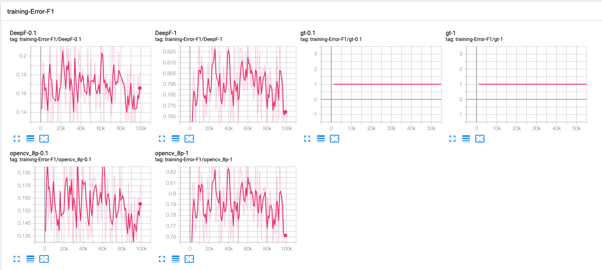
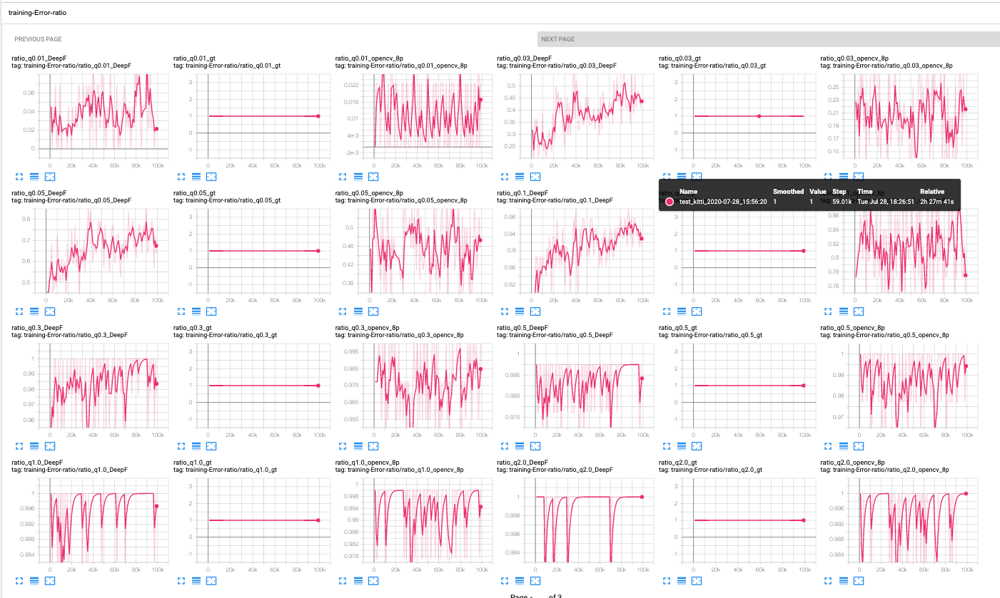

# pytorch-deepFEPE
Deep Keypoint-Based Camera Pose Estimation with Geometric Constraints.

## Installation
### Requirements
- python == 3.6
- pytorch >= 1.1 (tested in 1.3.1)
- torchvision >= 0.3.0 (tested in 0.4.2)
- cuda (tested in cuda10)
```
conda create --name py36-deepfepe python=3.6
conda activate py36-sp
pip install -r requirements.txt
pip install -r requirements_torch.txt # install pytorch
```
### Pull and link Superpoint model
```
cd pytorch_superpoint
git pull
cd ../
cd utils/
ln -s ../pytorch_superpoint/utils/*.py .
```
- install superpoint module
```
git clone git@github.com:eric-yyjau/pytorch-superpoint.git
cd pytorch-superpoint
git checkout module_20200707
# install
pip install --upgrade setuptools wheel
python setup.py bdist_wheel
pip install -e .
```
  - if `ascii` error
  ```
  export LC_ALL=en_US.UTF-8
  export LANG=en_US.UTF-8
  export LANGUAGE=en_US.UTF-8
  ```
- install DeepF module


## Dataset
- Data preprocessing
```
cd deepFEPE_data
```
- Follow the instructions in the [README](https://github.com/eric-yyjau/deepFEPE_data/blob/master/README.md).
- Process `KITTI` dataset for training or testing.
- Process `ApolloScape` dataset for testing.

## Config file
- Key items
```yaml
dump_root: '[your dumped dataset]' # apollo or kitti
if_qt_loss: true # use pose-loss and F-loss (true) or only F-loss (false)
if_SP: true (use superpoint instead of SIFT)/ false (SIFT)
# deepF
retrain: true (new deepF model)/ false (use pretrained deepF)
train: true (train the model)/ false (freeze weights)
pretrained: [Path to pretrained deepF]
# superpoint
retrain_SP: true (new superpoint model)/ false (use pretrained_SP)
train_SP: true (train SP model)/ false (freeze SP weights)
pretrained_SP: [Path to pretrained SP]
```


## Run the code - Training
Prepare the dataset. Use training commands following steps 1 to 3 (skip step 0).
Visualize training and validation with Tensorboard.
### Training commands
- KITTI
```
python deepFEPE/train_good.py train_good deepFEPE/configs/kitti_corr_baseline.yaml test_kitti --eval
```
- ApolloScape
```
python deepFEPE/train_good.py train_good deepFEPE/configs/apollo_train_corr_baseline.yaml test_apo --eval
```

### 0) Baseline: Train deepF model with SIFT features
- config file: `deepFEPE/configs/kitti_corr_baseline.yaml`
- config: 
  - set `dump_root` to `[your dataset path]`
  - set `if_SP` to `False`
- run training script

### 1) Prepare SuperPoint model 
- Follow the instruction in [pytorch-superpoint](https://github.com/eric-yyjau/pytorch-superpoint).
- Or use the **pretrained models**.
- git lfs file: `deepFEPE/logs/superpoint_models.zip`
  - KITTI: `deepFEPE/logs/superpoint_kitti_heat2_0/checkpoints/superPointNet_50000_checkpoint.pth.tar`
  - Apollo: `deepFEPE/logs/superpoint_apollo_v1/checkpoints/superPointNet_40000_checkpoint.pth.tar`

### 2) Train deepF model with SuperPoint pretrained models
- config: 
  - Set `if_SP` to `True`. 
  - Add `pretrained_SP` path.

### 3) End-to-end training
- config: 
  - Set `train` to `True`
  - Set `train_SP` to `True`
  - Set the pretrained paths in `pretrained` and `pretrained_SP`.
  - Set `if_qt_loss: true` for pose-loss.
  


## Run the code - Testing
- KITTI: use `kitti_corr_baselineEval.yaml`
```
python deepFEPE/train_good.py eval_good deepFEPE/configs/kitti_corr_baselineEval.yaml eval_kitti --test --eval # use testing set (seq 09, 10)
```
- ApolloScape: use `apollo_train_corr_baselineEval.yaml`
```
python deepFEPE/train_good.py eval_good deepFEPE/configs/apollo_train_corr_baselineEval.yaml eval_apo --test --eval
```

You can use our pretrained models for testing. Just put the paths in the `config` file.
- Our **pretrained models**:
(Refer to the config.yml and checkpoints/ in the folder)
  - KITTI models (trained on KITTI):
    - git lfs file: `deepFEPE/logs/kitti_models.zip`
    - SIFT Baselines: 
      - `baselineTrain_deepF_kitti_fLoss_v1`
      - `baselineTrain_sift_deepF_kittiPoseLoss_v1`
      - `baselineTrain_sift_deepF_poseLoss_v0`
    - SuperPoint baselines:
      - `baselineTrain_kittiSp_deepF_kittiFLoss_v0`
      - `baselineTrain_kittiSp_deepF_kittiPoseLoss_v1`
    - DeepFEPE:
      - `baselineTrain_kittiSp_deepF_end_kittiFLoss_freezeSp_v1`
      - `baselineTrain_kittiSp_deepF_end_kittiFLossPoseLoss_v1_freezeSp`
      - `baselineTrain_kittiSp_kittiDeepF_end_kittiPoseLoss_v0`
  - Apollo models (trained on Apollo, under apollo/):
    - git lfs file: `deepFEPE/logs/apollo_models.zip`
    - SIFT baselines:
      - `baselineTrain_sift_deepF_fLoss_apolloseq2_v1`
      - `baselineTrain_sift_deepF_poseLoss_apolloseq2_v0`
      - `baselineTrain_sift_deepF_apolloFLossPoseLoss_v0`
    - SuperPoint baselines:
      - `baselineTrain_apolloSp_deepF_fLoss_apolloseq2_v0`
      - `baselineTrain_apolloSp_deepF_poseLoss_apolloseq2_v0`
    - DeepFEPE:
      - `baselineTrain_apolloSp_deepF_fLoss_apolloseq2_end_v0_freezeSp_fLoss`
      - `baselineTrain_apolloSp_deepF_poseLoss_apolloseq2_end_v0`
      - `baselineTrain_apolloSp_deepF_fLossPoseLoss_apolloseq2_end_v0_freezeSp_fLoss`


## Run the code - batch testing and evaluation
### Run the evaluation
```
cd deepFEPE/
python run_eval_good.py --help
```
- update your dataset path in `configs/kitti_corr_baselineEval.yaml` and `configs/apollo_train_corr_baselineEval.yaml`
- set the model names in `deepFEPE/run_eval_good.py`
```python
def get_sequences(...):
    kitti_ablation = { ... }
    apollo_ablation = { ... }
```
- check if the models exist
```
# kitti models on kitti dataset
python run_eval_good.py --dataset kitti --model_base kitti --exper_path logs --check_exist
# kitti models on apollo dataset
python run_eval_good.py --dataset apollo --model_base kitti --exper_path logs --check_exist

# apollo models
python run_eval_good.py --dataset kitti --model_base apollo --exper_path logs/apollo --check_exist
```
- run the evaluation (dataset should be ready)
```
python run_eval_good.py -dataset kitti --model_base kitti --exper_path logs --runEval
```
### Read out the results
- open jupyter notebook
- read the sequences from the config file: `table_trans_rot_kitti_apollo.yaml`
```yaml
base_path: '/home/yoyee/Documents/deepSfm/logs/' # set the path for checkpoints
seq_dict_test:
    Si-D.k: ['eval_kitti', 'DeepF_err_ratio.npz', '07/29/2020']
```

- print out the numbers based on the setting in the config file
```
jupyter notebook
# navigate to `notebooks/exp_process_table.ipynb`
```

### Download the results
```
git lfs ls-files # check the files
git lfs fetch 
git lfs pull # get the files
```
- unzip 
```
cd deepFEPE/logs/results/ 
unzip 1107.zip 
unzip 1114.zip 
unzip new_1119.zip
```
- put to the same folder
```
ln -s 1114/* . # do the same for the other folders
```
- Then, you can follow the instructions in `Read out the results`.

### Evaluate visual odometry
```
jupyter notebook
# navigate to `notebooks/exp_process_table.ipynb`
```
- convert the `relative_pose_body` to absoluted poses
- export the poses to two files for sequence `09` and `10`.
- use `kitti-odom-eval` for evaluation.

## Tensorboard
```
tensorboard --logdir=runs/train_good
```

## Pretrained models

## Jupyter notebook
- visualization
  - Ex: Train SIFT + DeepF
    - check loss: gt should always be 1
    
    - check R, t inlier ratio: 
    ```yaml
    rotation: q, angle: 0.01 to 180
    translation: t, angle: 0.01 to 180
    # (higher the better)
    # pick the checkpoints through inlier ration 
    ```
    


## Citations
Please cite the following papers.
- DeepFEPE
```
```
- SuperPoint
```
@inproceedings{detone2018superpoint,
  title={Superpoint: Self-supervised interest point detection and description},
  author={DeTone, Daniel and Malisiewicz, Tomasz and Rabinovich, Andrew},
  booktitle={Proceedings of the IEEE Conference on Computer Vision and Pattern Recognition Workshops},
  pages={224--236},
  year={2018}
}
```
- DeepF
```
@inproceedings{ranftl2018deep,
  title={Deep fundamental matrix estimation},
  author={Ranftl, Ren{\'e} and Koltun, Vladlen},
  booktitle={Proceedings of the European Conference on Computer Vision (ECCV)},
  pages={284--299},
  year={2018}
}
```


# Credits
This implementation is developed by [You-Yi Jau](https://github.com/eric-yyjau) and [Rui Zhu](https://github.com/Jerrypiglet). Please contact You-Yi for any problems. 

# License
DeepFEPE is released under the MIT License. 
